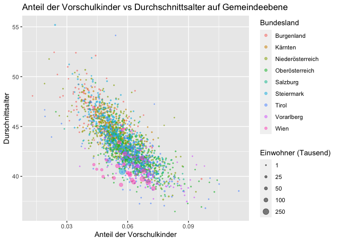

<!-- README.md is generated from README.Rmd. Please edit that file -->

# bevstat

<!-- badges: start -->
<!-- badges: end -->

The goal of bevstat is to visualize some population data from Statistik
Austria. Especially the population data of Austria from the year 2020,
which can be found
[here](https://data.statistik.gv.at/web/meta.jsp?dataset=OGD_bevstandjbab2002_BevStand_2020).

## Installation

You can install the development version from
[GitHub](https://github.com/) with:

``` r
# install.packages("devtools")
devtools::install_github("MaximilianBernkopf/bevstat")
```

## Example

Via `get_population_data` you can download the relevant data and have
certain internal codes replaced by more useful names. Alternatively you
can also just use the data already available in the package:

``` r
library(bevstat)
#population_df <- get_population_data()
population_df
#> # A tibble: 392,508 x 7
#>    time_section sex   state_number commune_number commune      age number
#>           <dbl> <chr> <chr>        <chr>          <chr>      <dbl>  <dbl>
#>  1         2020 male  1            10101          Eisenstadt     0     77
#>  2         2020 male  1            10101          Eisenstadt     1     75
#>  3         2020 male  1            10101          Eisenstadt     2     70
#>  4         2020 male  1            10101          Eisenstadt     3     83
#>  5         2020 male  1            10101          Eisenstadt     4     67
#>  6         2020 male  1            10101          Eisenstadt     5     56
#>  7         2020 male  1            10101          Eisenstadt     6     75
#>  8         2020 male  1            10101          Eisenstadt     7     73
#>  9         2020 male  1            10101          Eisenstadt     8     74
#> 10         2020 male  1            10101          Eisenstadt     9     86
#> # … with 392,498 more rows
```

Next the function `summarise_population_df` performs some summary
statistics. In particular it takes the data frame returned by
`get_population_data` or `population_df` directly and calculates the
relative size of each age group per commune as well as the average age
in each commune. Note that the information regarding gender is first
summarized. Furthermore, the state name is added, e.g., “Wien”,
“Burgenland” etc.

``` r
population_summary_df <- summarise_population_df(population_df)
#> Joining, by = "state_number"
population_summary_df
#> # A tibble: 203,079 x 7
#>    state   commune_number commune    age relative_size_age_gr… average_age_per_…
#>    <chr>   <chr>          <chr>    <dbl>                 <dbl>             <dbl>
#>  1 Burgen… 10101          Eisenst…     0               0.00857              43.1
#>  2 Burgen… 10101          Eisenst…     1               0.00965              43.1
#>  3 Burgen… 10101          Eisenst…     2               0.00945              43.1
#>  4 Burgen… 10101          Eisenst…     3               0.0105               43.1
#>  5 Burgen… 10101          Eisenst…     4               0.00884              43.1
#>  6 Burgen… 10101          Eisenst…     5               0.00877              43.1
#>  7 Burgen… 10101          Eisenst…     6               0.00864              43.1
#>  8 Burgen… 10101          Eisenst…     7               0.0103               43.1
#>  9 Burgen… 10101          Eisenst…     8               0.00931              43.1
#> 10 Burgen… 10101          Eisenst…     9               0.0108               43.1
#> # … with 203,069 more rows, and 1 more variable: commune_inhabitants <dbl>
```

Finally you may plot the average age per commune vs the proportion of
preschool kids as follows



Have fun.
